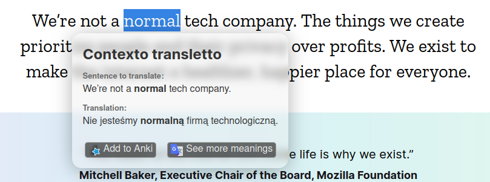

# Contexto Transletto
Hi, this web browser extension is my side project, which allows users to easily translate unknown foreign language words into their native language and add them into anki flashcards.

## Installation
Download .xpi or .crx file from latest release (.xpi for firefox, .crx for chrome),
after opening downloaded file your browser wil automatically guide you through the installation process.

## Limitations
Because this is beta version:
- Only english to Polish support
- Currently, app isn't deployed on any store (only firefox .xpi and .crx files are available)

## Usage
1. Select the word you want to translate
2. Right-click on the selected word
3. Click on the `Translate selection` option

## Screenshots:

